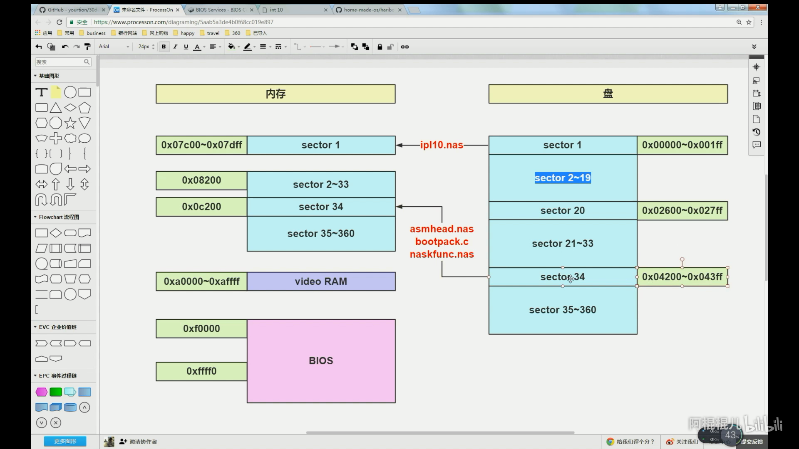

# 第3天：进入32位模式并导入C语言

双击 `./第3天：进入32位模式并导入C语言/data/make.bat` 可见如下结果：


## 内容装入


## 使屏幕一半变为白色

### asmhead.nas

在 `画面モードを設定` 完毕之后，`通过BIOS获取指示灯状态` 之前添加下面的代码段，使屏幕一半变为白色。

```assembly
;DS = 0xa000, SI=0, DS : SI=0xa0000
MOV BX,DS
MOV AX,0xa000
MOV DS,AX
MOV SI,0
draw:
MOV [SI],BYTE 15;15 表示白色
ADD SI,1
CMP SI,320*100;屏幕是 320*200 这里取其一半
JBE draw
MOV DS,BX
```

修改后的部分代码如下：

```assembly
;... ...
; 画面モードを設定

		MOV		AL,0x13			; VGA显卡，320x200x8bit
		MOV		AH,0x00
		INT		0x10
		MOV		BYTE [VMODE],8	; 屏幕的模式（参考C语言的引用）
		MOV		WORD [SCRNX],320
		MOV		WORD [SCRNY],200
		MOV		DWORD [VRAM],0x000a0000
		
		;DS = 0xa000, SI=0, DS : SI=0xa0000
        MOV BX,DS
        MOV AX,0xa000
        MOV DS,AX
        MOV SI,0
        draw:
        MOV [SI],BYTE 15;15 表示白色
        ADD SI,1
        CMP SI,320*100;屏幕是 320*200 这里取其一半
        JBE draw
        MOV DS,BX

; 通过BIOS获取指示灯状态

;... ...
```

### 原理分析

在 `画面モードを設定` 有这样一句：

```assembly
MOV		DWORD [VRAM],0x000a0000
```

上面的 VRAM 为 [Video RAM](https://baike.baidu.com/item/VRAM/910598?fr=aladdin) 。这一句设定显存的起始地址为 0x000a0000 。添加的代码段将 `0x000a0000~0x000a0000+320*100` 的内容设为 15（即白色），之后我们看到的屏幕上半部分就变成了白色。

#### 预备知识 - 显存

如同计算机的内存一样，显存是用来存储要处理的图形信息的部件。我们在显示屏上看到的画面是由一个个的像素点构成的，而每个像素点都以4至32甚至64位的数据来控制它的亮度和色彩，这些数据必须通过显存来保存，再交由显示芯片和CPU调配，最后把运算结果转化为图形输出到显示器上。显存和主板内存一样，执行存贮的功能，但它**存贮的对像是显卡输出到显示器上的每个像素的信息**。显存是显卡非常重要的组成部分，显示芯片处理完数据后会将数据保存到显存中，然后由RAMDAC（数模转换器）从显存中读取出数据并将数字信号转换为模拟信号，最后由屏幕显示出来。

